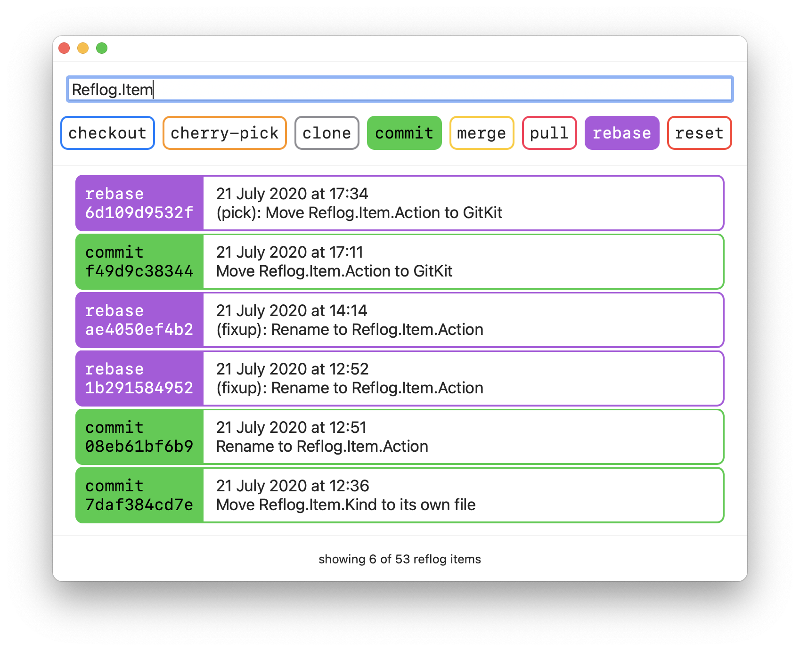

# `git reflog-ui`

Makes it even easier to find your lost commits in the [`git reflog`](https://git-scm.com/docs/git-reflog).



## Installation

git-reflog-ui requires `libgit2` to be installed using homebrew before building.

```sh
brew install libgit2
```

I recommend using the awesome utility [Mint](https://github.com/yonaskolb/Mint) for installation.

```sh
mint install danielctull-apps/git-reflog-ui
```

## Usage

git reflog-ui can only be run from the command line. When inside your working directory running the following will pop open the floating window.

```sh
git reflog-ui
```

## Thanks

There's code in this little app that takes heavy inspiration from the following. Thank you so much. 🧡

* [Chris Eidhof](https://github.com/chriseidhof) for his [boilerplate.swift](https://gist.github.com/chriseidhof/26768f0b63fa3cdf8b46821e099df5ff) gist which shows all the configuration needed to get a macOS app running from the command line.
* [Matt Gallagher](https://twitter.com/cocoawithlove) for his blog post [Minimalist Cocoa programming](https://www.cocoawithlove.com/2010/09/minimalist-cocoa-programming.html) which was useful background information to Chris' boilerplate gist.

